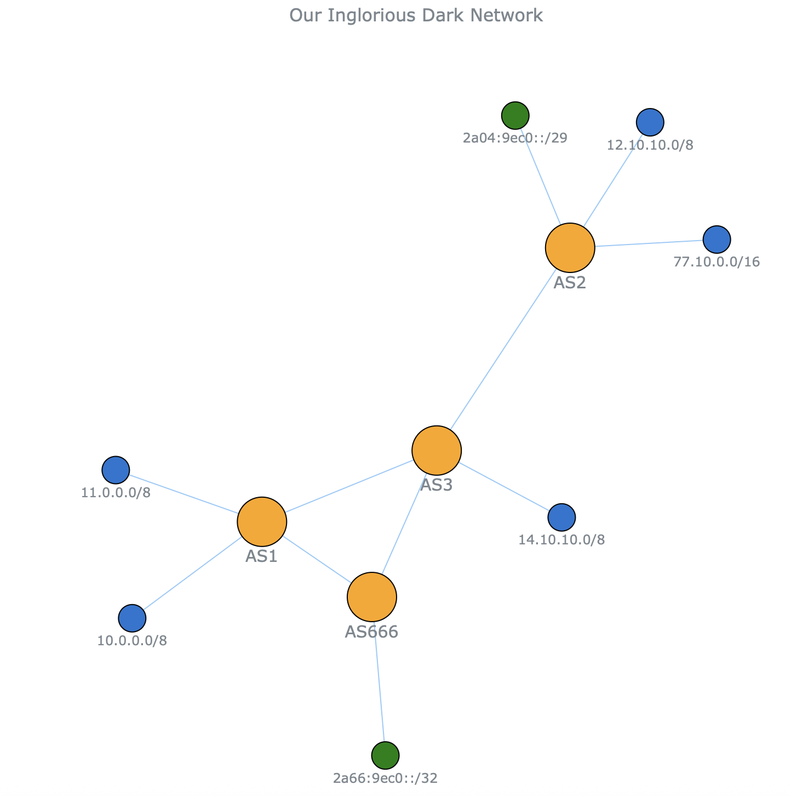

# Flask-SSE-Graph
#### Generate and stream dynamic network graphs to browsers using Flask, Server-Sent Events and AnyChart Network Graphs.

The Server-Sent Events (SSE) API enables pushing messages/updates from a server to the web page via HTTP connection.

Server-Sent Events - One Way Messaging
A server-sent event is when a web page automatically gets messages/updates from a server.

Normally, a web page has to request data from the server, but with server-sent events, the updates are pushed automatically.

### Example Graph


### How to use
1. Clone or download this repository
2. Install the dependencies:
```
$ pip install -r requirements.txt
```
3. Run the server using graph.py file:
```
$ python3 graph.py